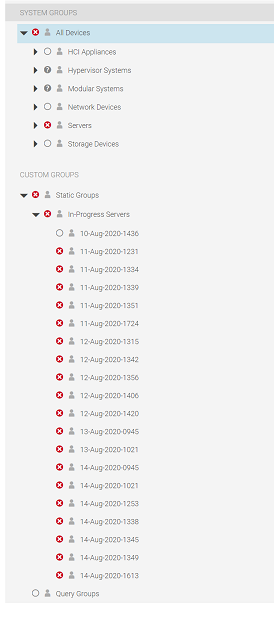

# OME Inventory Scan Tool

## How it works

There are only three commands you will ever need to run in the tool:

1. Starting the DHCP server should you choose to use it. Alternatively you can just pass a list of server idrac IPs
2. Running an initial scan to generate your initial inventory
3. Running a final scan which will compare the inventory created by the initial scan to a new one. The output is a new inventory

## Installation

1. Install Python 3 (it must be Python 3 - Python 2 is deprecated) for your platform from [here](https://www.python.org/downloads/).
2. Download and unzip this program [from here](https://github.com/grantcurell/omeinventory/archive/master.zip). You can put it anywhere you like.
3. Open a command prompt and change directories to wherever you downloaded the program and go to the `code` directory.
4. Run `pip install -r requirements.txt`

You're done.

## Running the Program

1. On the command line, navigate to the `code` directory of the program.
2. (Optional) Run the DHCP server: `python scan_hardware.py --start-dhcp-server`
   1. This is optional because as noted below, you can also create a list of server ips and pass that in.
   2. If you want to change the configuration for the DHCP server, the configuration file is at `lib/dhcpserv/dhcpgui.conf`.
   3. The DHCP serve is from Nicco Kunzmann and is largely unmodified. I did remove the GUI from it. You can see it's documentation [here](https://github.com/niccokunzmann/python_dhcp_server).
   4. The DHCP server stores its entries in a file called `hosts.csv` at `lib/dhcpserv/hosts.csv`. It will also print any DHCP requests or responses it receives to console.
3. Run the initial scan: `python scan_hardware.py --servers <some_files_with_a_list_of_server_ips> --omeip <your_ome_ip> --omeuser admin --omepass <your_password> --idracuser <your_idrac_user> --idracpass <your_idrac_password> --scan initial`
   1. If your username is admin, you can omit the `--omeuser` switch. It will default to admin.
   2. If your idrac username is root, you can omit the `--idracuser` swich. It defaults to root.
   3. If you use a servers file, it should look like this (one IP address per IP):
   
            192.168.1.18
            192.168.1.19
            192.168.1.20
            etc
   4. If you plan to use entries discovered from the DHCP server then you can drop the switch `--server`.
   5. The output of the initial scan will be under `output/<dd-mm-yyyy-time>-initial.xlsx`.
   6. For your convienience, this also creates a group with the time and date of the scan in OME.

        
4. Run the final scan: `python scan_hardware.py --omeip <your_ome_ip> --omeuser admin --omepass <your_ome_pass> --scan final`
   1. The final output will be under `output/<dd-mm-yyyy-time>.xlsx`.
   2. If you're not careful this can cause you some problems, but if you want you can change the inventory against which you are comparing using the `--inventory` argument. In the directory `inventories` will be a list of inventories that have been generated. If you want to use a different one than `last_inventory.bin` you can specify it on the command line with `--inventory <some_inventory>.bin`.

## Relevant Files and Folders

### DHCP Config

The DHCP configuration is at `lib/dhcpserv/dhcpgui.conf`.

### DHCP Entries

DHCP entries will be stored in `lib/dhcpserv/hosts.csv`.

### inventories Folder

This folder is really for internal use. That said, it has the raw inventory for all servers in it.

### output Folder

This is the folder you will care most about. As mentioned above, it has all the outputs you care about. Output from the initial scan will have the name `output/<dd-mm-yyyy-time>-initial.xlsx`. Outputs from a final scan will have name `output/<dd-mm-yyyy-time>.xlsx`.

#### What's the difference between the initial and final output?

The initial output doesn't have the deltas tab in the excel spreadsheet showing the difference between the first inventory and the last inventory.

## What does each scan do (high level)?

### Initial Scan

It takes all the IP addresses you gave it either from DHCP or from the servers file and runs an OME discovery scan. After it finishes that it will force power off all the servers and then turn them back on. This it to make absolutely sure that the inventory is fresh and the status being reporting by idrac is correct. Then it tells OME to reach out to all the servers and ensure OME has the latest and greatest inventory. After that it runs an inventory and health check against all servers.

### Final Scan

First it loads the data from the last discovery job ran and the last inventory. Then, just like the initial scan, it force shuts down all the servers and then turns them back on to ensure the idrac is reporting the absolute latest information. It then forces OME to rerun an inventory on all the servers to verify that OME has the absolute latest data. Finally, it runs a new inventory against all the servers and then compares that inventory against the old one to get the difference between the two.

## Sample Output

You can see the files:

- [Sample Initial Inventory](sample_inventories/14-Aug-2020-1755-initial-scan.xlsx)
- [Sample Final Inventory](sample_inventories/14-Aug-2020-1802.xlsx)

For examples of what the final output looks like. The tabs are as follows:

- \<service tag\>-inventory: An inventory for a specific server.
- Hardware Status - The current health status of each server along with all of its subsystems
- Hardware Errors - Any errors OME reported with any of the servers
- Inventory Deltas - Any differences found between the first and the second inventory.

## Getting Help

If you have any problems with the program create a ticket [here](https://github.com/grantcurell/omeinventory/issues). It would be helpful if you upload the files `discovery_scans/latest_discovery.bin`, `inventories/latestest_inventory.bin`, and the ouput XLSX that you got along with any error information you received.

## No, really Grant, I'm actually reading the readme. How does it work?

Ok so here's what the code really does.

### Initial Scan

First it takes all the IP addresses you provided and gives those to OME. It then creates a discovery job in OME, just like you would usually do if you went into OME and did it manually. The result of the discovery process is that the program now has a database of three things:

- The idrac IP (you provided that)
- The service tag
- The internal OME ID

The internal OME ID is important because everything in the [OME API](https://topics-cdn.dell.com/pdf/dell-openmanage-enterprise_api-guide5_en-us.pdf) uses this internal ID. It also creates a group with format dd-mm-yyyy-time in OME which has all the servers discovered in this scan. After the scan finishes it does a couple of internal things that don't really matter to you as an internal user. For housekeeping, it creates a `discovery_scans` folder which has a binary database of a Python dictionary calls servers. This dictionary contains all the aforementioned server data in binary form. When you go to run the next scan it pulls from the file called `last_discovery.bin`. While you as a user shouldn't mess with this unless you really want to get into the guts of the code. you can actually use the debugging command `--discovery` to manually specify which discovery database you want to use. Though I wouldn't recommend doing this because if you don't get all the options right things are going to go horribly wrong. Next it makes a number of API calls to shutdown the servers and then turn them back on. This is because the idrac will only poll for status periodically. What can happen is that if you don't do this then the idrac may have stale information. What's more is that OME only polls the idracs every now and again for any alert status. So after the idracs reboot you also have to tell OME to recheck the inventories. After it does all that it's ready to actually take the inventory. This process creates the inventories folder you end up seeing. This stores all the underlying inventory files. Each of the bin files you see is actually a binary dump of a Python dictionary representing all of the inventory data used to generate the XLSX file. This code is actually a pretty big PITA. The reason is each subsystem in OME has different fields so there is custom logic for every single subsystem to make sure that all this output works correctly. For example the slots for PCI have different field names than disks.

### Final Scan

If I'm being honest, it's 6:03 on a Friday and I've been at this since like 0730 this morning. I also have a sneaky suspicion most people don't care much about the inner workings of some Python code, but if you really do hit me up at grant_curell@dell.com and I'll tell you all about it.

The only real difference between the initial and final scan is that the final scan has to compare the original inventory and the initial inventory. Originally I thought I could get away with just checking the internal OME IDs of each device. WRONG. Of course it wasn't that easy. Whenever you rerun the inventory tasks all the device IDs change so instead what I had to do was write custom logic for every single subsystem to compare the slot numbers - which oh by the way have different names depending on the subsystem. So under the hood what the comparison function does is iterate over every slot in the initial inventory and then look for that slot in the second inventory. If it exists then it reports any differenecs between the two. Where this got annoying as a programmer is that the slot may or may not be present or for some things like hard drives they didn't have slots. For hard drives I ended up using the serial number for comparison. If the serial number of a drive is in the first inventory but not in the second then I know that you removed a drive. You can use the reverse to check for adding a drive. Basically you end up doing an exhastive check of all the different combinations of adding and removing based on either slot number or serial number. That explanation was a bit lazy, but normally nobody reads this stuff. If you are realy curious I'm happy to tell you about it. Just drop me a line.